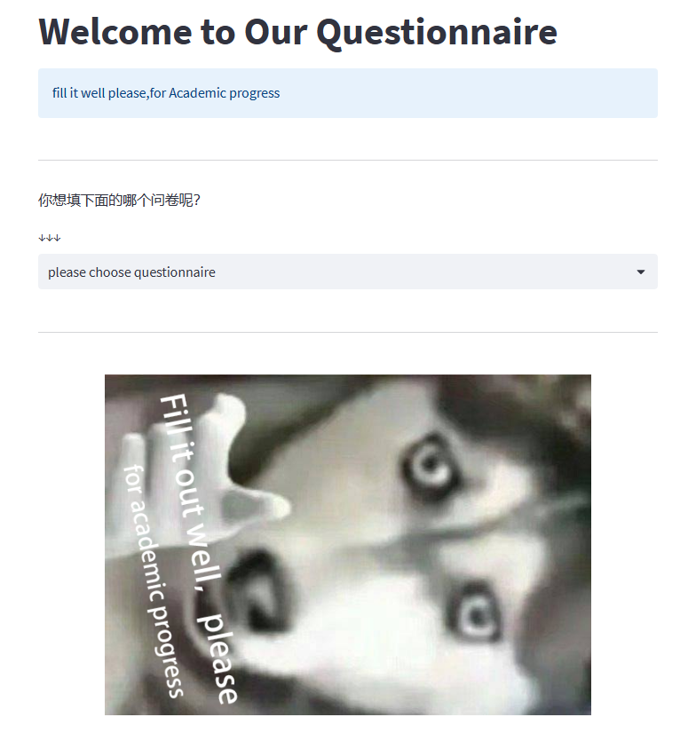
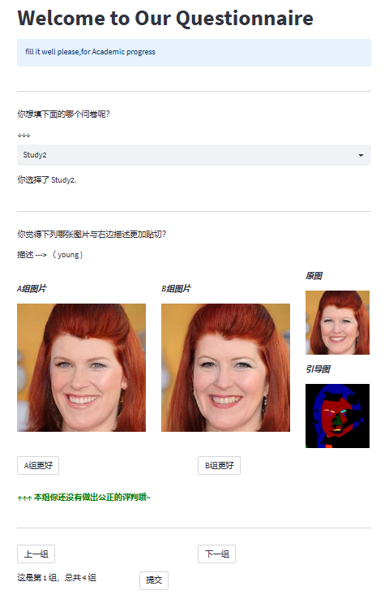
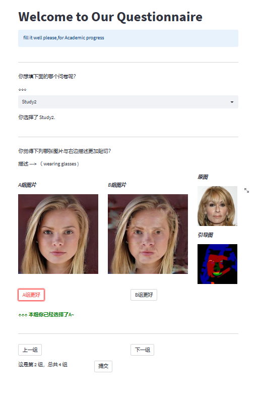

## Introduction

An anonymous questionnaire survey developed using `streamlit`.


## Environment Preparation

- Python 3.7
- PIL
- streamlit


## Quick Start

run the following command to quick experience the project.

```python
streamlit run start.py
```


The questionnaire is categorized by folder in `./data/UserStudy/`, such as`Study1`and`Study2`. Please match the order of the images one by one with `describe. txt`.


please do not delete `Please choose questionnaire` folder, otherwise unexpected errors may occur.


## About Multi-threading

Whenever a browser tag is used to access the `Streamlit ` application, a separate user session is created, with access being independent of access.  At the same time, each questionnaire submission will independently generate a txt file based on the time code and store it in `./result/`. Therefore, there is no need for additional multi-threading control.


## deploy

If you only need internal network access, you can directly run `start.py` in the Python environment of the server.

If you need public IP or domain name access, please refer to the `nginx ` environment configuration yourself.


## Visualization

### Questionnaire selection interface




### Questionnaire answering interface




